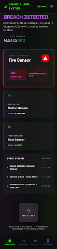

# Smart Alarm System With Event Prioritization 🚨



Welcome to the **Smart Alarm System With Event Prioritization** project! This repository contains the source code, hardware implementation details, and documentation for a comprehensive IoT-based security dashboard. 

Built with an ESP32 microcontroller, a modern cross-platform **Flutter mobile app**, and Blynk IoT, this system allows you to **monitor and control your home from anywhere in the world**. The bespoke mobile app enables users to actively monitor live sensor data, prioritize critical events intuitively, and instantly take action (like remotely resetting the hardware in case of an alarm).

## 📺 Project Demonstration
[](https://www.youtube.com/watch?v=PkwltHFsIFA)

*Click the image above or [here](https://www.youtube.com/watch?v=PkwltHFsIFA) to watch the full demonstration video on YouTube.*

## 📑 Project Resources
We have included detailed documentation to help you understand the architecture and implementation:
- **Project Report:** [`EEE304-July2025-A2-G04_report.pdf`](./EEE304-July2025-A2-G04_report.pdf)
- **Presentation Deck:** [`EEE304-July2025-A2-G04.pptx`](./EEE304-July2025-A2-G04.pptx)

## ✨ Key Features
- **Real-Time Global Monitoring:** Connect to the dedicated Flutter mobile app to consistently monitor your home's security status from anywhere.
- **Intelligent Event Prioritization:** The system logically interprets and prioritizes critical life-safety hazards (like Fire outbraks) over standard alerts (like Motion or Door opens) to draw immediate attention.
- **Sensor Coverage:**
  - 🏃‍♂️ **PIR Sensor:** Detects motion in the designated area.
  - 🔥 **Flame Sensor:** Detects fire/smoke hazards instantly.
  - 🚪 **Door Sensor:** Magnetic reed switch to monitor door open/close status.
- **Cross-Platform Flutter App:** A beautifully designed mobile app featuring kinetic UI elements, a 3D physical remote reset switch, and dynamic status LED indicators for tracking system state.
- **Web Dashboard:** Simple HTML/web-based monitoring interface included alongside the app.
- **Remote Control from Anywhere:** Reset or configure the ESP32 hardware remotely via the mobile app through the robust Blynk IoT cloud platform.

## 🛠️ Technology Stack
- **Hardware Controller:** ESP32 Microcontroller
- **Mobile Application:** Flutter (Dart)
- **Web Application:** HTML/CSS/JS (`dashboard.html`)
- **IoT Cloud Platform:** [Blynk](https://blynk.io/)
- **Sensors:** PIR Motion Sensor, Digital Flame Sensor, Magnetic Reed Switch (Door)

## 📁 Repository Structure
```text
├── esp32_smart_alarm.ino             # C++ code for the ESP32 microcontroller
├── smart_alarm/                      # Flutter mobile application source code
├── dashboard.html                    # Web-based live dashboard interface
├── remote_control_guide.md           # Architectural guide for remote IoT integrations
├── stitch_screenshot.png             # UI screenshot
├── EEE304-July2025-A2-G04.pptx       # Presentation slides
└── EEE304-July2025-A2-G04_report.pdf # Comprehensive project report
```

## 🚀 Getting Started

### 1. Hardware Setup (ESP32)
1. Open `esp32_smart_alarm.ino` in the Arduino IDE.
2. Install the necessary libraries from the Library Manager: `WiFi` and `blynk`.
3. Update the WiFi credentials (`ssid` and `pass`) and your `BLYNK_AUTH_TOKEN`.
4. Wire the sensors according to the defined pins:
   - **PIR:** `Pin 35`
   - **Flame:** `Pin 32`
   - **Door:** `Pin 33`
   - **Status LED:** `Pin 2` (Built-in)
5. Compile and flash the code to your ESP32.

### 2. Mobile App Setup (Flutter)
1. Ensure you have the [Flutter SDK](https://flutter.dev/docs/get-started/install) installed on your machine.
2. Navigate to the `smart_alarm` directory in your terminal:
   ```bash
   cd smart_alarm
   ```
3. Fetch dependencies:
   ```bash
   flutter pub get
   ```
4. Run the app on your connected device or emulator:
   ```bash
   flutter run
   ```

### 3. Blynk Configuration
Set up your Blynk console with the following virtual datastreams corresponding to the firmware:
- `V0`: PIR Motion (Integer 0/1)
- `V1`: Flame Sensor (Integer 0/1)
- `V2`: Door Sensor (Integer 0/1)
- `V3`: Remote Reset Button (Integer 0/1)

---
*Developed for the digital logic design / electronic engineering lab course.*
